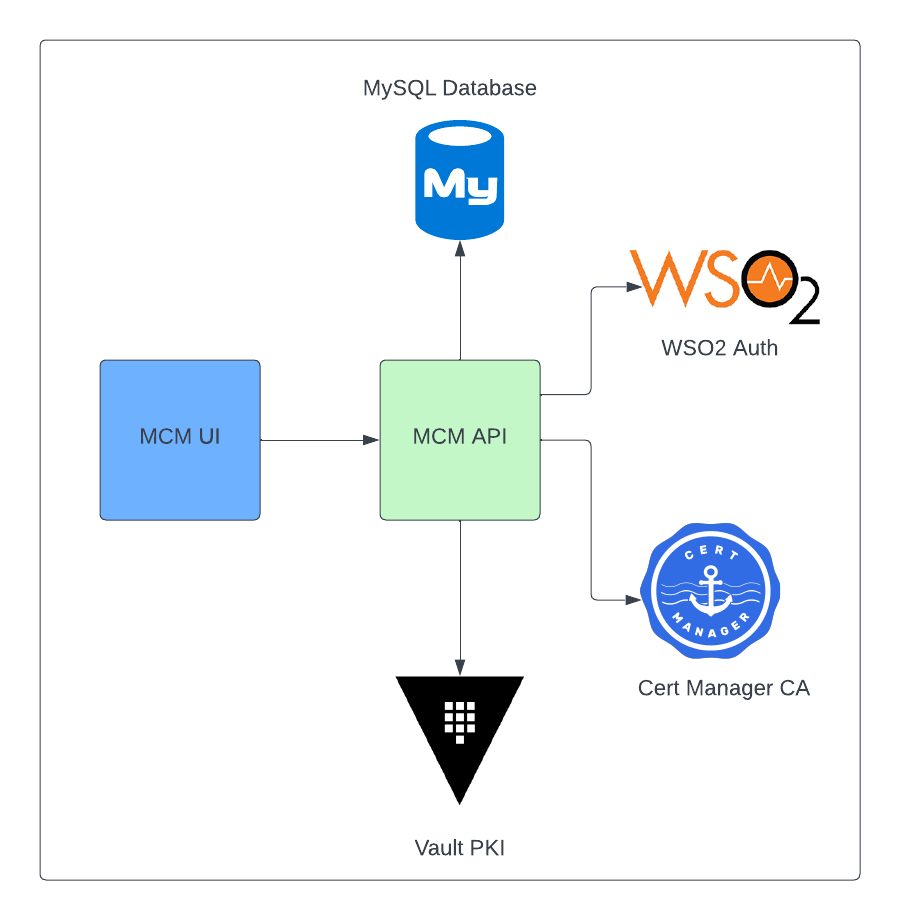

# Connection Manager API

[](https://github.com/modusbox/connection-manager-api/actions/workflows/releaseWorkflow.yml)




Connection Manager API is a component of the Mojaloop ecosystem that allows an administrator to manage the network configuration and PKI information for the Hub and a set of DFSPs.

It provides a REST API, described using a [Swagger/OpenAPI document](./src/api/swagger.yaml).

The API servers uses OAuth2 to implement security, as defined in the [OAuth2 implementation doc](./oauth2.md)

## DFSP onboarding process using MCM

Here you can find a [document and video describing the onboarding processs using MCM](https://infitx.atlassian.net/wiki/spaces/CS/pages/18776713/SOP0009+-+HUB+PM4ML+-+On-boarding+Payment+Manager+v.0.1-20220307)

## Running the server locally

You'll need a db instance available. you can setup one by running:
```./scripts/run-mysql.sh```

now install dependencies:
```npm ci```

install vault:
```./scripts/run-vault.sh```

specify a development test run:
```export TEST=true```

you can now start the service: 
```npm start```

you can go see the swagger definition at `localhost:3001`

## Configuration

There's a [Constants.js file](./src/constants/Constants.js) that pulls the values from the environment or uses defaults if not defined.

Variables:

|Environment variable|Description|Default Value
:---|:---|:---
| **MCM API server configuration**
|PORT|mcm API HTTP port|3001
| **Authentication features**
|AUTH_ENABLED|Enables support for OAuth2. 'TRUE' to enable| (disabled)
|AUTH_2FA_ENABLED|Enables two-factor authentication 'TRUE' to enable| (disabled)
| **OAuth2 roles**
|MTA_ROLE|DFSP Admin role|'Application/MTA'
|PTA_ROLE|HUB Admin Role|'Application/PTA'
|EVERYONE_ROLE|Authenticated users role|'Internal/everyone'
| **WSO2 OAuth Service Provider configuration**
|APP_OAUTH_CLIENT_KEY|OAuth2 Client Key. Configured in WSO2 IM Service Provider|
|APP_OAUTH_CLIENT_SECRET|OAuth2 Client Secret. Configured in WSO2 IM Service Provider|
|CERTIFICATE_FILE_NAME|WSO2 **Service Provider** Public Certificate filename. If the value starts with `/` it will be read as an absolute path, otherwise as a relative path to the app dir|'resources/wso2carbon-publickey.cert'
|EMBEDDED_CERTIFICATE|WSO2 **Service Provider** Public Certificate PEM-encoded string. This one has priority over the previous var|
| **WSO2 OAuth server configuration**
|OAUTH2_ISSUER|OAuth token issuer endpoint. This service will connect to this endpoint to request the JWTs |https://WSO2_IM_SERVER:9443/oauth2/token
|OAUTH2_TOKEN_ISS|JWTs have an `iss` property. This property is usually the same as the endpoint (`OAUTH2_ISSUER`), but it may differ for example if there's an HTTP gateway with a different endpoint in between. You can use `OAUTH2_TOKEN_ISS` to specify the expected value of the `iss` property. This service validates that the value of the `iss` property on the JWT it receives on the API calls either is equal to either OAUTH2_ISSUER or OAUTH2_TOKEN_ISS; if there's no match then authentication will fail with a 401.|
| **Database configuration**
|DATABASE_HOST|mysql host|localhost
|DATABASE_PORT|mysql port|3306
|DATABASE_USER|mysql user|mcm
|DATABASE_PASSWORD|mysql password|mcm
|DATABASE_SCHEMA|mysql schema|mcm
|DB_RETRIES|Times the initial connection to the DB will be retried|10,
|DB_CONNECTION_RETRY_WAIT_MILLISECONDS|Pause between retries|5000,
|RUN_MIGRATIONS|If true, run db schema migration at startup. Can always be true as the schema creation is idempotent|true,
|CURRENCY_CODES|Path to file containing all the supported currency codes|'./data/currencyCodes.json',
|DATA_CONFIGURATION_FILE|Initial data configuration path. See specific doc|'./data/sampleConfiguration.json'
| **WSO2 custom services configuration**
|TOTP_ADMIN_ISSUER|URL of TOTP Admin (WSO2)|
|TOTP_ADMIN_AUTH_USER|user of TOTP Admin|
|TOTP_ADMIN_AUTH_PASSWORD|pass of TOTP Admin|
|TOTP_LABEL|a label to be shown with 2FA|
|TOTP_ISSUER|a issuer to be shown with 2FA|MCM
|WSO2_MANAGER_SERVICE_URL|URL of WSO2 Manager Service|
|WSO2_MANAGER_SERVICE_USER|user of WSO2 Manager Service|
|WSO2_MANAGER_SERVICE_PASSWORD|pass of WSO2 Manager Service|
|OAUTH_RESET_PASSWORD_ISSUER|URL of reset password issuer (WSO2)|
|OAUTH_RESET_PASSWORD_AUTH_USER|user of WSO2 reset password service (WSO2)|
|OAUTH_RESET_PASSWORD_AUTH_PASSWORD|password of WSO2 reset password service (WSO2)|
| **MCM Internal Certificate Authority configuration**
|P12_PASS_PHRASE|Pass phrase used to save the internal CA Key in the DB.|
| **Support for self-signed certificates on OAuth Server and other TLS client connections**
|EXTRA_CERTIFICATE_CHAIN_FILE_NAME|Extra trusted server certificate chain file name ( PEM-encoded, as explained in https://nodejs.org/api/tls.html#tls_tls_createsecurecontext_options )|
|EXTRA_ROOT_CERT_FILE_NAME|Extra trusted server root certificate file name|

## Authentication

User authentication can be enabled using WSO2. The service is able to login, change password and logout. WSO2 Configuration must be set in place using the above ENV variables.

## Cert Renewal

When Registering or changing a CA, the API will use the Cert-Manager CRD to renew the Certificate.

## Testing

- Run integration tests:
  - `npm run test`

### Functioanl Tests

Refer to [the functional tests README](./test/functional-tests/README.md).
